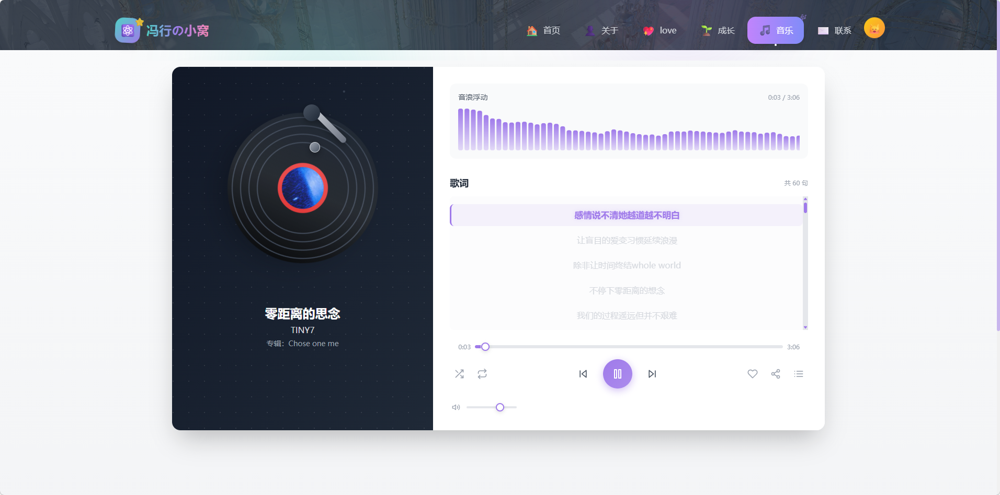

# 个人博客网站 (React + Tailwind CSS)

一个现代化、响应式的个人博客网站实现，基于 React 和 Tailwind CSS 构建，具有优雅的 UI 设计和流畅的用户体验。

在线预览地址https://devserver-dev--famous-wisp-ba5e6c.netlify.app/

爱心参考网站：https://love.burnham.xin/

<div align="center">





</div>

> 注意：以上图片仅在项目运行时可以正常显示。请执行 `npm start` 启动项目后查看。

## 目录

- [功能特点](#功能特点)
- [技术栈](#技术栈)
- [项目结构](#项目结构)
- [安装和运行](#安装和运行)
- [构建生产版本](#构建生产版本)
- [页面功能介绍](#页面功能介绍)
- [自定义配置](#自定义配置)
- [图片替换指南](#图片替换指南)
- [浏览器支持](#浏览器支持)
- [贡献](#贡献)
- [许可证](#许可证)

## 功能特点

- 📱 **响应式设计** - 完美适配移动端、平板和桌面设备
- 🖱️ **动态导航栏** - 滚动时自动调整样式
- 🌟 **特色文章展示区** - 突出优质内容
- 🃏 **文章卡片布局** - 带有精美的悬停动画效果
- 🔖 **分类导航系统** - 方便内容浏览（首页、关于、联系、旅行、音乐、爱情等）
- 👤 **作者信息展示** - 包含社交链接
- 📧 **邮件订阅功能** - 便于用户获取更新
- 🚀 **平滑滚动** - 回到顶部功能
- 🎵 **音乐播放器** - 集成黑胶唱片播放界面，带歌词同步显示
- ✈️ **旅行页面** - 展示旅行相关内容
- 💖 **爱情页面** - 特殊页面设计，提供沉浸式体验
- 🎨 **现代化UI设计** - 采用毛玻璃效果、渐变色彩等设计元素

## 技术栈

- **前端框架**: [React 19](https://reactjs.org/)
- **路由管理**: [React Router v7](https://reactrouter.com/)
- **样式解决方案**: [Tailwind CSS 3](https://tailwindcss.com/) + PostCSS + Autoprefixer
- **构建工具**: [Create React App](https://create-react-app.dev/)
- **图标库**: [React Feather](https://github.com/feathericons/react-feather)
- **测试套件**: 
  - [@testing-library/react](https://testing-library.com/docs/react-testing-library/intro/)
  - [@testing-library/jest-dom](https://github.com/testing-library/jest-dom)
- **开发规范**: [ESLint](https://eslint.org/) + [Prettier](https://prettier.io/)

## 项目结构

```
.
├── public
│   ├── index.html
│   ├── manifest.json
│   └── imgs/
│       └── Preview/
├── src
│   ├── components
│   │   ├── common
│   │   │   ├── BackToTop.jsx
│   │   │   └── SubscribeForm.jsx
│   │   ├── layout
│   │   │   ├── Footer.jsx
│   │   │   ├── Navbar.jsx
│   │   │   └── Sidebar.jsx
│   │   └── posts
│   │       ├── FeaturedPost.jsx
│   │       ├── PostCard.jsx
│   │       └── PostList.jsx
│   ├── pages
│   │   ├── About.jsx
│   │   ├── Article.jsx
│   │   ├── Contact.jsx
│   │   ├── Home.jsx
│   │   ├── LovePage.css
│   │   ├── LovePage.jsx
│   │   ├── Music.jsx
│   │   ├── NotFound.jsx
│   │   ├── PostDetail.jsx
│   │   ├── Travel.jsx
│   │   └── Music.jsx
│   ├── utils
│   │   └── data.js
│   ├── App.css
│   ├── App.js
│   ├── App.test.js
│   ├── index.css
│   ├── index.js
│   ├── reportWebVitals.js
│   └── setupTests.js
├── IMAGE_REPLACEMENT_GUIDE.md
├── README.md
├── package-lock.json
├── package.json
├── postcss.config.js
└── tailwind.config.js
```

## 安装和运行

1. 克隆项目到本地：

   ```bash
   git clone https://github.com/your-username/my-blog.git
   ```

2. 进入项目目录：

   ```bash
   cd my-blog
   ```

3. 安装依赖：

   ```bash
   npm install
   # 或者使用 yarn
   yarn install
   ```

4. 启动开发服务器：

   ```bash
   npm start
   # 或者使用 yarn
   yarn start
   ```

5. 在浏览器中访问 http://localhost:3000 查看网站

## 构建生产版本

运行以下命令构建生产版本：

```bash
npm run build
# 或者使用 yarn
yarn build
```

构建后的文件将位于 `build/` 目录中，可以部署到任何静态网站托管服务上。

## 页面功能介绍

- **首页 (Home)**: 展示特色文章和最新内容
- **关于 (About)**: 个人介绍和技能展示
- **联系 (Contact)**: 联系方式和留言表单
- **旅行 (Travel)**: 旅行相关内容展示
- **音乐 (Music)**: 集成音乐播放器，支持黑胶唱片播放界面、歌词同步等功能
- **爱情 (LovePage)**: 特殊页面设计，提供沉浸式体验
- **文章详情 (PostDetail)**: 文章详细内容展示
- **404页面 (NotFound)**: 页面不存在时的友好提示

## 自定义配置

| 配置文件 | 用途 |
|---------|------|
| [`tailwind.config.js`](tailwind.config.js) | Tailwind CSS 配置 |
| [`postcss.config.js`](postcss.config.js) | PostCSS 配置 |
| [`src/App.css`](src/App.css) | 应用全局样式 |
| [`src/index.css`](src/index.css) | 入口全局样式 |
| [`src/utils/data.js`](src/utils/data.js) | 静态数据配置 |

## 图片替换指南

1. 参考 [`IMAGE_REPLACEMENT_GUIDE.md`](IMAGE_REPLACEMENT_GUIDE.md) 文件中的详细说明
2. 准备符合要求的图片文件
3. 将图片文件放入 `public/imgs/` 目录中
4. 替换同名文件以更新网站中的图片
5. 对于音乐播放器中的专辑封面，请放入 `public/audio/` 目录中

## 浏览器支持

项目支持所有现代浏览器，包括：
- Chrome (最新2个版本)
- Firefox (最新2个版本)
- Safari (最新2个版本)
- Edge (最新2个版本)

## 贡献

欢迎提交 issue 和 pull request 来帮助改进这个项目。对于重大更改，请先开 issue 讨论您想要改变的内容。

1. Fork 项目
2. 创建功能分支 (`git checkout -b feature/AmazingFeature`)
3. 提交更改 (`git commit -m 'Add some AmazingFeature'`)
4. 推送到分支 (`git push origin feature/AmazingFeature`)
5. 开启 Pull Request

## 许可证

本项目采用 MIT 许可证。有关更多信息，请参阅 [LICENSE](LICENSE) 文件。

---
> 项目仍在持续开发和完善中，欢迎提出宝贵意见和建议！